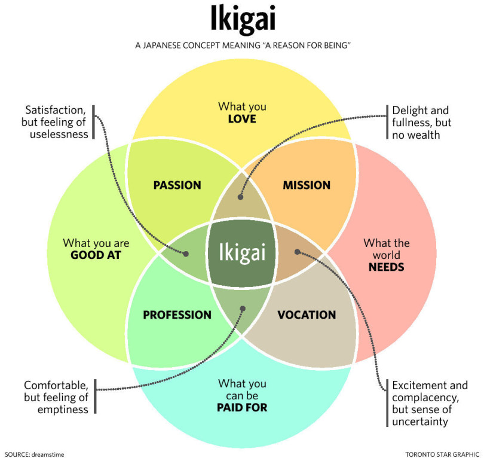

# Ikigai: The Japanese Secret to a Long and Happy Life - Héctor García, Francesc Miralles

## Whatever you do, don't retire!

One surprising thing you notice, living in Japan, is how active people remain after they retire. In fact, many Japanese people never really retire -- they keep doing what they love for as long as their health allows.

> According to Dan Buettner, a _National Geographic_ reporter who knows the country well, having a purpose in life so important in Japanese culture that our idea of retirement simply doesn't exist there.

## The 80% secret

One of the most common sayings in Japan is "Hara hachi bu", which is repeated before or after eating and means something like "Fill your belly to 80%".

> Ancient wisdom advises against eating until we are full. This is why Okinawans stop eating when they feel their stomachs reach 80% of their capacity,

rather than overeating and wearing down their bodies with log digestive processes that accelerate cellular oxidation.

Of course, there is no way to know objectively if your stomach is at 80% capacity. The lesson to learn from this saying is that we should stop eating when we are starting to feel full. The extra side dish, the snack we eat when whe know in our hearts we don't really need it, the apple pie after lunch --- all these will give us pleasure in the short term, but not having them will make us happier in the long term.

> The way food is served is also important. By presenting their meals on many small plates, the Japanese tend to eat less.

A typical meal in a restaurant in Japan is served in five plates on a tray, four of them very small and the main dish slightly bigger. Having five plates in front of you makes it seem like you are going to eat a lot, but what happens most of the time is that...

## Antifragility

### Create redudancies

Instead of having a single salary, try to find a way to make money from your hobbies, at other jobs, or by starting your own business. If you have only one salary, you might be left with nothing should your employer run into trouble, leaving you in a position of _fragility_

> If you have several options and you lose your primary job, it might just happen that you end up dedicating more time to your secondary job, and maybe even make more money at it.

The same idea goes for friendships and personal interests.

## Real life example of Ikigai

> Ruby is my lifework, so I will never retire from developing Ruby. I want to be involved in the Ruby development as long as I’m alive -- Matz

## Links

- [Ikigai Inspiration](https://instagram.com/ikigai__inspiration?igshid=1e2emj2zgdt89)
- [What is Japanese "forest bathing" and how can it improves your health](https://www.facebook.com/worldeconomicforum/videos/10154303720471479/)
- [10 Key Points of Ruby Development: Special Interview with Matz and Mr. Miyagawa of Rebuild.fm](https://blog.sideci.com/10-key-points-of-ruby-development-7803ec2e792b?gi=1be554cc74a8)
